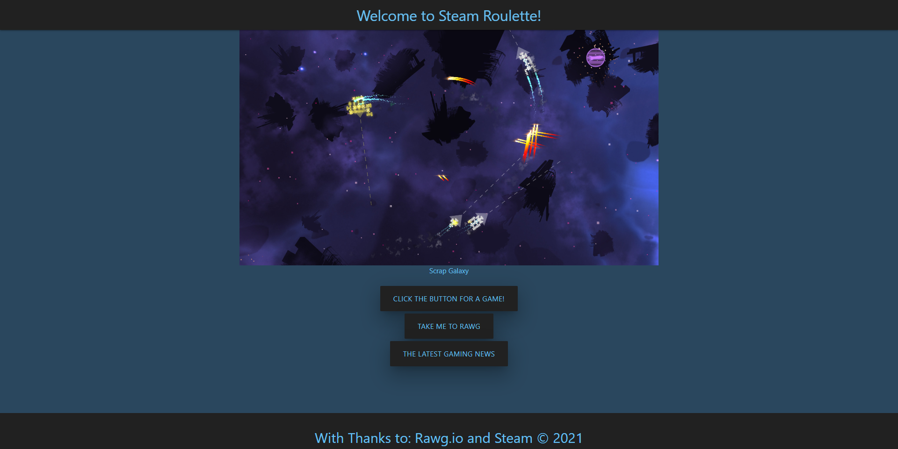

# Game-Randomizer

Don't know what game to play on Steam next? Check out "Steam Roulette," where we'll shuffle the entire Steam Library for you! Don't like our suggestion? Click the randomizer as much as you want until you find a game that piques your interest!

# User Story

AS A USER who plays games.
I WANT to utilize "Steam Roulette" to randomly suggest a game to play.
SO THAT I can select a game to play based on randomization.

# Description

A randomizer is any piece of software or hardware that can produce random numbers, items, words, and more, etc. Different requirements call for different types of randomizers. For example, someone is trying to figure out what to make for dinner, so they utilize a recipe generator to randomly suggest one for them.

# Contributors

Angelica Sargent, James O'Keefe, Mark Andersen, & Scott Core

# Screenshot

 

# Link

Check out Steam Roulette [here](https://agraysargent.github.io/Game-Randomizer/)!